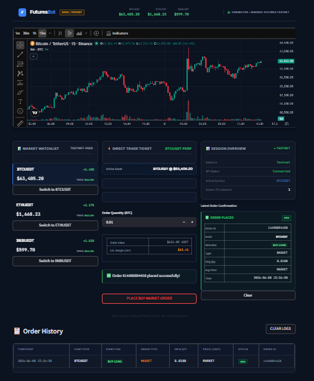
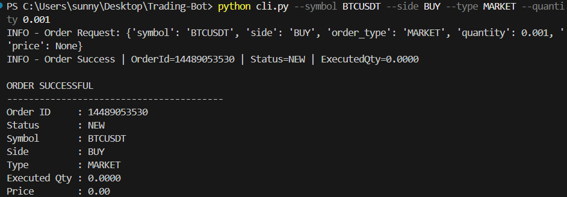
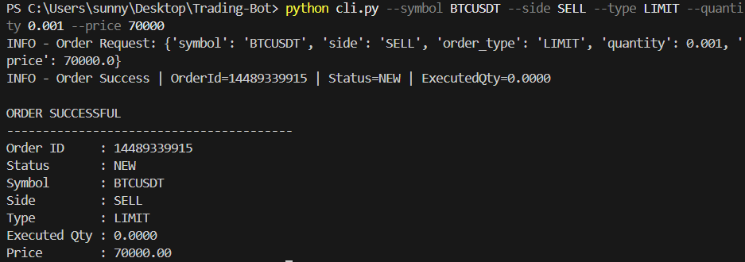
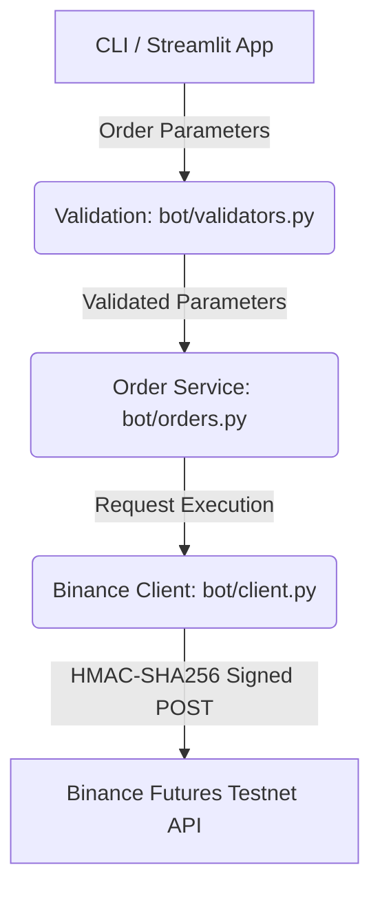

# Binance Futures Demo Trading Bot ⚡

[](https://www.python.org/)
[](https://streamlit.io/)
[](https://testnet.binancefuture.com)
[](https://opensource.org/licenses/MIT)

A Python trading bot and Streamlit dashboard connected to the Binance Futures Testnet. This repository provides a scriptable Command Line Interface (CLI) and a web-based dashboard interface to monitor markets, validate user inputs, and execute simulated trades using testnet endpoints.

---

## 📸 Screenshots

### Dashboard


### MARKET Order Example


### LIMIT Order Example


---

## ⚙️ Assumptions

* **Testnet Account**: The user has an active Binance Futures Testnet account.
* **API Credentials**: Valid Testnet API credentials (API Key and API Secret) are available.
* **Internet Access**: Active internet access is available to connect to the external Binance API.
* **TradingView Connectivity**: Embedded charts require external connectivity to resolve live market data from TradingView CDN nodes.
* **Simulated Execution**: All trade orders execute exclusively on the Binance Futures Testnet environment.
* **Session-bound Logs**: Streamlit session-based order history is stored in application state memory and resets when the Streamlit server restarts.

---

## ⚡ Features

* **Dual-Interface Operation**: Submit orders either through the automated scriptable CLI (`cli.py`) or the browser-based Streamlit UI (`app.py`).
* **Binance Futures Testnet Integration**: Wrapper for client requests authenticated against the Binance Testnet endpoints.
* **Order Execution Types**: Supports simulated execution of `MARKET` and `LIMIT` (Good 'Til Cancelled) orders.
* **Cryptographic Request Signing**: Internal request constructor that generates HMAC-SHA256 signatures with UNIX timestamp salting for security.
* **Interactive Watchlist Selection**: Selection card layout for major trading pairs (`BTCUSDT`, `ETHUSDT`, `BNBUSDT`) that serves as a click handler to dynamically update the active asset focus.
* **Embedded Technical Charts**: Direct integration of a dark-themed TradingView advanced financial widget loaded below the navigation bar.
* **Dual-Channel Logging**: Coordinates standard output tracking and application-level file logs.

---
## ⚡ Quick Start

```bash
git clone https://github.com/SunnySatwik/Trading-Bot.git
cd Trading-Bot

pip install -r requirements.txt

streamlit run app.py
---

## 🏗️ Architecture Overview

The system architecture decouples user interface layers (CLI and Web Dashboard) from validation, logging, cryptographic signing, and API client request logic:



### Component Breakdown
1. **CLI / Streamlit GUI**: Ingests user input parameters (ticker symbol, buy/sell action, order type, size, and limit trigger price).
2. **Validator Engine (`bot/validators.py`)**: Sanitizes strings, parses quantities, checks numeric bounds, and enforces type requirements (such as requiring price fields for LIMIT trades).
3. **Order Manager (`bot/orders.py`)**: Coordinates validator workflows and captures errors, passing signed payload responses downstream while capturing system logging states.
4. **Binance REST Client (`bot/client.py`)**: Handles outbound REST calls, constructs parameter query strings, signs payloads with user environment secrets, and checks response statuses.

---

## 📁 Project Structure

Below is the directory tree of the repository:

```text
Trading-Bot/
├── .env                  # Local environment configurations (Git-ignored)
├── .env.example          # Sample environment variables template
├── .gitignore            # Git repository exclusion definitions
├── README.md             # Project documentation (this file)
├── app.py                # Streamlit live dark dashboard 
├── cli.py                # Scriptable Command Line Interface
├── requirements.txt      # Project system libraries dependencies
├── trading_bot.log       # Local runtime system logs (Git-ignored)
├── bot/                  # Primary backend source code package
│   ├── __init__.py       # Package indicator file
│   ├── client.py         # Binance Futures REST Client & HMAC signing
│   ├── logging_config.py # Logging configurations routing setup
│   ├── orders.py         # Trade action orchestration layer
│   └── validators.py     # Request sanitization and validation engine
├── sample_logs/          # Preconfigured execution samples
│   └── trading_bot.log.sample # Mock logs detailing system operations
└── screenshots/          # Platform preview screenshots
    ├── dashboard.png         # Web terminal dashboard view
    ├── limit_order_cli.png   # Command-line LIMIT order sample run
    └── market_order_cli.png  # Command-line MARKET order sample run
```

---

## ⚙️ Environment Variables

The application requires your Binance Futures Testnet API credentials. Create a `.env` file in the project root based on the template:

```ini
# .env.example
BINANCE_API_KEY=your_api_key_here
BINANCE_API_SECRET=your_secret_here
```

> [!WARNING]
> Do NOT commit your `.env` file containing active API credentials to Git. The project `.gitignore` is pre-configured to block `.env` uploads to secure repository histories.

---

## 🚀 Installation

Follow these steps to configure your local system:

1. **Clone the Repository**:
   ```bash
   git clone https://github.com/SunnySatwik/Trading-Bot.git
   cd Trading-Bot
   ```

2. **Establish Environment Configuration**:
   ```bash
   cp .env.example .env
   ```
   *Edit the newly created `.env` file and insert your Binance Futures Testnet keys.*

3. **Install Dependencies**:
   ```bash
   pip install -r requirements.txt
   ```

---

## 🖥️ Running the Application

### 1. Command Line Interface (CLI)

The CLI tool accepts flags for direct execution:

| Argument | Requirement | Accepted Values | Description |
|---|---|---|---|
| `--symbol` | **Required** | `BTCUSDT`, `ETHUSDT`, `BNBUSDT` | Ticker symbol |
| `--side` | **Required** | `BUY`, `SELL` | Order side |
| `--type` | **Required** | `MARKET`, `LIMIT` | Order execution type |
| `--quantity` | **Required** | Positive Float | Position amount to trade |
| `--price` | Optional | Positive Float | Required limit trigger price for `LIMIT` orders |

#### MARKET Order Execution:
```bash
python cli.py --symbol BTCUSDT --side BUY --type MARKET --quantity 0.005
```

#### LIMIT Order Execution:
```bash
python cli.py --symbol ETHUSDT --side SELL --type LIMIT --quantity 0.5 --price 3450.50
```

---

### 2. Streamlit Dashboard

Run the visual terminal:

```bash
streamlit run app.py
```

Once loaded, the terminal is available via your web browser (typically on `http://localhost:8501`). 

The web UI includes:
* **Interactive Watchlist**: Select assets to update the main order details and chart dynamically.
* **Direct Trade Ticket**: Configure quantity, trigger values, and submit trades.
* **Real-time Charts**: Integrates a responsive, low-latency TradingView widget.
* **Order History Logs**: Visualizes order confirmation status and list of successful orders placed during the session.

---

## 📋 Logging

System logs are routed dynamically during execution to keep developer cycles audit-safe.

* **Log Location**: Stored locally in a project-root file called `trading_bot.log`.
* **Git Exclusions**: Runtime logs are ignored from version control to prevent local execution noise from polluting source trees.
* **Example**:

```text
2026-06-08 14:05:32 INFO Order Request | Symbol=BTCUSDT | Side=BUY | Type=MARKET
2026-06-08 14:05:32 INFO Order Success | OrderId=14486984539 | Status=NEW
```

---

## 🔍 Validation Examples

The validation engine validates inputs before sending requests to Binance Futures, saving latency and credentials limits:

### 1. Invalid Order Side Spec
If the CLI receives a side option other than `BUY` or `SELL`:
```bash
python cli.py --symbol BTCUSDT --side HOLD --type MARKET --quantity 0.01
```
**Expected Error Console Output:**
```text
ERROR: Side must be BUY or SELL
```

### 2. Missing LIMIT Price
If a `LIMIT` order type is specified but the trigger price flag is missing:
```bash
python cli.py --symbol BTCUSDT --side BUY --type LIMIT --quantity 0.01
```
**Expected Error Console Output:**
```text
ERROR: Price is required for LIMIT orders
```

---

## 🛠️ Technologies Used

* **Python**: Core programming language.
* **Streamlit**: Modern interactive dashboard interface.
* **Requests**: HTTP client library for REST calls.
* **TradingView Widget**: Interactive live asset charts.
* **Binance Futures API**: Public ticker endpoints and authenticated private REST API (Futures Testnet).
* **python-dotenv**: Environment configuration manager.
* **Pandas**: Structured parsing of visual tables.

---

## 🔒 Security Notes

* **Credential Decoupling**: API keys are securely decoupled from the codebase and loaded from `.env`.
* **Repo Guarding**: Pre-configured `.gitignore` file guarantees private files (`.env`, `trading_bot.log`, and cached artifacts) are never pushed.
* **Zero Real Capital Risk**: This project is configured to use the Binance Futures Testnet environment for simulated trading. No real funds are exposed.

---

## 🚀 Future Improvements

* **Persistent Database Logging**: Migrate session-bound history log views to structured SQL database storage (e.g. SQLite).
* **WebSocket Streams**: Replace REST-based short pooling with persistent WebSockets to yield sub-second ticker calculations.
* **Expanded Account Balance Displays**: Enable real-time portfolio value updates by querying account balance and position endpoints.
* **Advanced Order Routing**: Support complex routing types like Stop-Loss (SL) and Take-Profit (TP) conditions.

---

## 📄 License

This project is licensed under the MIT License. See below for details:

```text
MIT License

Copyright (c) 2026 Sunny Satwik

Permission is hereby granted, free of charge, to any person obtaining a copy
of this software and associated documentation files (the "Software"), to deal
in the Software without restriction, including without limitation the rights
to use, copy, modify, merge, publish, distribute, sublicense, and/or sell
copies of the Software, and to permit persons to whom the Software is
furnished to do so, subject to the following conditions:

The above copyright notice and this permission notice shall be included in all
copies or substantial portions of the Software.

THE SOFTWARE IS PROVIDED "AS IS", WITHOUT WARRANTY OF ANY KIND, EXPRESS OR
IMPLIED, INCLUDING BUT NOT LIMITED TO THE WARRANTIES OF MERCHANTABILITY,
FITNESS FOR A PARTICULAR PURPOSE AND NONINFRINGEMENT. IN NO EVENT SHALL THE
AUTHORS OR COPYRIGHT HOLDERS BE LIABLE FOR ANY CLAIM, DAMAGES OR OTHER
LIABILITY, WHETHER IN AN ACTION OF CONTRACT, TORT OR OTHERWISE, ARISING FROM,
OUT OF OR IN CONNECTION WITH THE SOFTWARE OR THE USE OR OTHER DEALINGS IN THE
SOFTWARE.
```
